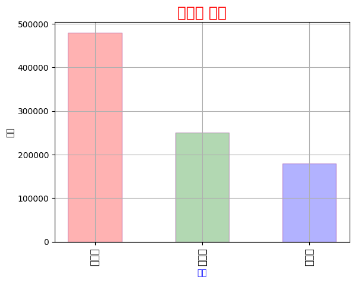
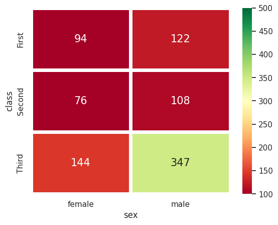
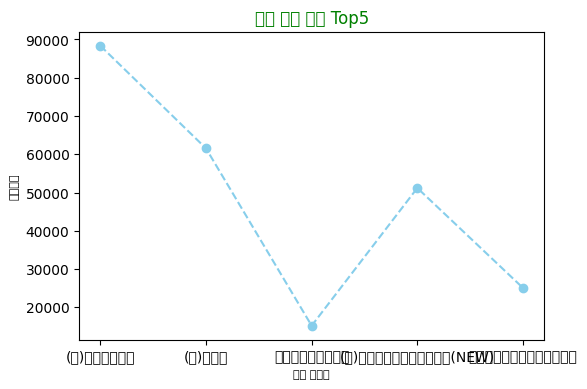

# 05. Matplotlib & Seaborn

Matplotlib과 Seaborn을 이용한 데이터 시각화를 학습하며 다양한 그래프를 그려본 실습 코드입니다.

## 학습 내용

- 기본 막대그래프(`bar`/`barh`), 파이차트(`pie`)와 색상/스타일 옵션
- `plt.title`/`xlabel`/`ylabel`/`xticks`/`legend` 등 그래프 꾸미기
- 그래프를 이미지 파일로 저장 (`plt.savefig`)
- Seaborn 데이터셋(`tips`, `titanic`, `iris`)을 이용한 `barplot`, `countplot`, `violinplot`, `heatmap`
- `jointplot`, `FacetGrid`, `pairplot`, `PairGrid`로 여러 변수 간 관계 시각화
- 실제 데이터(영화 박스오피스, 제품 판매 등)를 `groupby`로 집계한 뒤 시각화

## 실습 파일

| 파일 | 학습 내용 |
|---|---|
| `01_bar_pie_charts_and_seaborn_intro.ipynb` | 막대/파이차트 기초 + Seaborn(tips/titanic/iris) 다양한 그래프 입문 |
| `02_boxoffice_visualization.ipynb` | 박스오피스 데이터 정제 후 배급사별 스크린수 시각화 |
| `03_boxoffice_visualization_retry.ipynb` | 위 실습을 다시 연습한 버전 |
| `04_bar_pie_and_seaborn_practice2.ipynb` | `01`과 유사한 내용을 다른 세션에서 재실습 |
| `05_boxoffice_visualization_practice3.ipynb` | 박스오피스 + 제품 데이터 시각화 세 번째 시도 |

## 실행 결과

`data/`의 CSV 파일(`supply.csv`, `KOBIS_역대_박스오피스.csv`, `it_product.csv`)로 이번 정리 작업 중 재실행하여 검증했습니다. `01`, `04`는 Seaborn 내장 예제 데이터셋(`tips`, `titanic`, `iris`)을 인터넷에서 내려받아 사용합니다.

### 대표 결과

## Troubleshooting

### 1. `NameError: name 'show' is not defined` (실제 발생한 오류)

**문제**

`04_bar_pie_and_seaborn_practice2.ipynb`에서 `plt,show()`처럼 마침표(`.`) 대신 쉼표(`,`)를 입력해 `show`가 `plt`의 메서드가 아니라 별개의 이름으로 해석되었습니다.

**원인**

`.`과 `,`는 위치가 가까운 키라 오타가 나기 쉽습니다. `plt,show()`는 "`plt`와 `show()`라는 두 값으로 이루어진 튜플"로 해석되며, 이때 `show`라는 이름이 정의되어 있지 않아 오류가 났습니다.

**해결**

`plt.show()`로 수정하면 됩니다. 이 셀에서는 파이차트 자체는 `plt.pie()` 호출 시점에 이미 그려져 이미지 출력은 남아있고, 그 다음 줄의 오타만 오류로 표시되었습니다.

### 2. 코드 셀에 주석이 아닌 일반 텍스트를 입력해 발생한 `SyntaxError` (실제 발생한 오류)

**문제**

`01_bar_pie_charts_and_seaborn_intro.ipynb`의 마지막 셀에 Seaborn 그래프 종류를 정리한 메모(`<seaborn>의 그래프 종류!` 등)를 `#` 주석 기호 없이 코드 셀에 그대로 입력해 `SyntaxError`가 발생했습니다.

**원인**

Jupyter의 코드 셀은 파이썬 코드로 해석되기 때문에, 설명 글을 남기려면 각 줄 앞에 `#`을 붙이거나 마크다운 셀에 작성해야 합니다.

**해결**

이런 메모는 코드 셀 대신 마크다운 셀에 작성하면 `SyntaxError` 없이 학습 내용을 정리할 수 있습니다. 이 저장소에서는 원본 그대로 남겨, Notebook에서 코드 셀과 마크다운 셀의 역할이 다르다는 점을 보여주는 사례로 남겼습니다.

### 3. 한글 폰트가 깨지는 문제

**문제**

Matplotlib에서 한글이 포함된 제목/축 라벨을 출력하면 그래프에 네모(□)로 표시되거나 `UserWarning: Glyph ... missing from font(s)`가 나타날 수 있습니다.

**원인**

기본 폰트에는 한글 글리프가 없기 때문입니다.

**해결**

`plt.rcParams['font.family'] = 'Malgun Gothic'`처럼 한글을 지원하는 폰트를 지정하면 해결됩니다(이 저장소의 노트북들도 대부분 이 방법을 사용하고 있습니다). Windows에서는 `Malgun Gothic`, macOS에서는 `AppleGothic`, Linux에서는 `NanumGothic` 등 운영체제에 맞는 폰트를 설치하고 지정해야 합니다.
